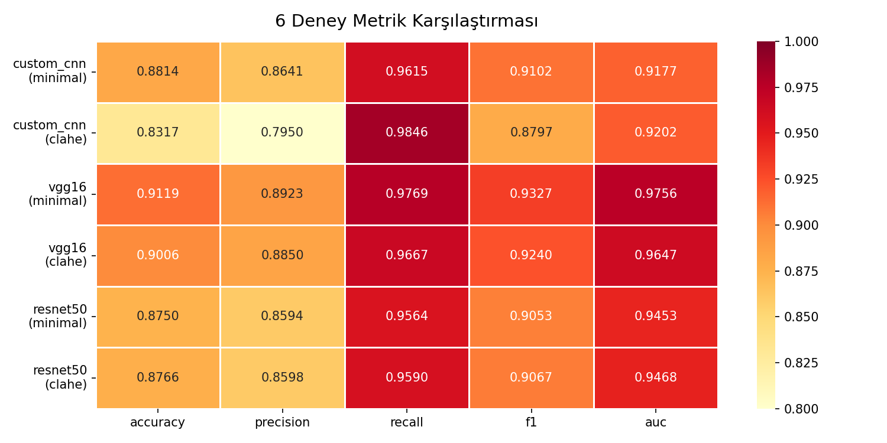
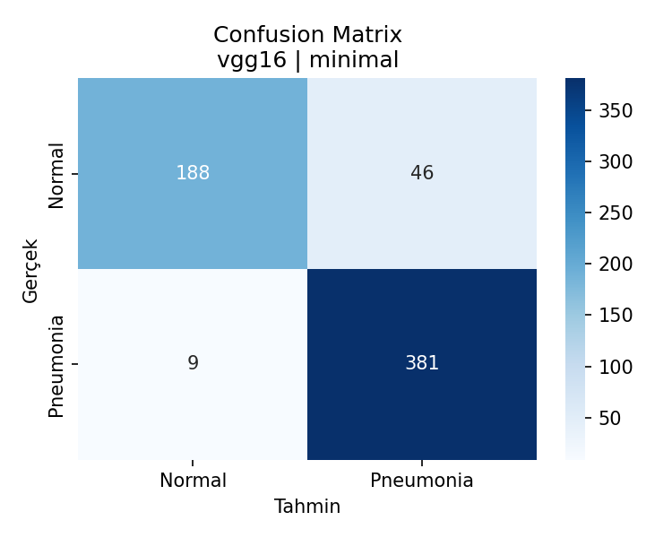
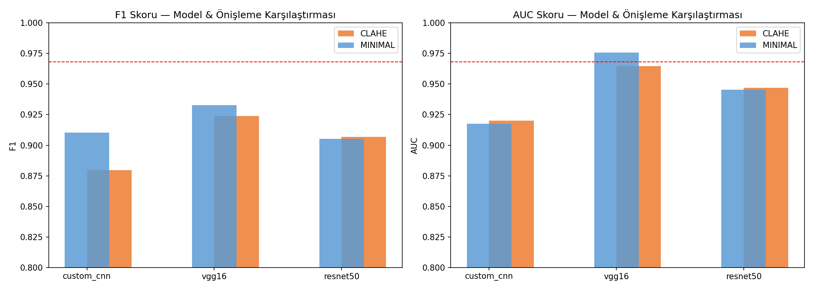
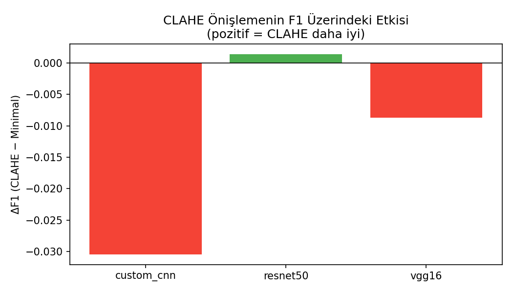
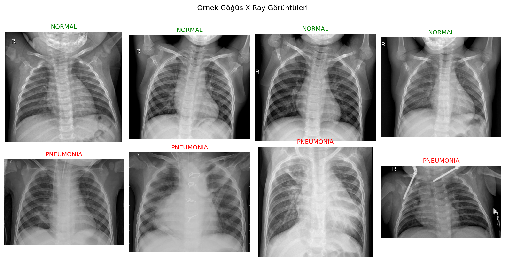

# 🫁 Göğüs Röntgeninden Pnömoni Tespiti

> **CNN Mimarilerinin ve Önişleme Tekniklerinin Karşılaştırmalı Analizi**  
> Derin Öğrenme Dersi Projesi | 2025–2026

---

## 📋 İçindekiler

- [Proje Hakkında](#-proje-hakkında)
- [Sonuçlar](#-sonuçlar)
- [Kullanılan Teknolojiler](#-kullanılan-teknolojiler)
- [Kurulum](#-kurulum)
- [Kullanım](#-kullanım)
- [Proje Yapısı](#-proje-yapısı)
- [Referanslar](#-referanslar)

---

## 🔬 Proje Hakkında

Pnömoni, dünya genelinde **5 yaş altı çocuklarda yılda 700.000'den fazla ölüme** neden olan en ölümcül bulaşıcı hastalıktır (UN IGME 2024). Dünya nüfusunun yaklaşık **üçte ikisi** tanısal görüntülemeye erişimden yoksundur (WHO). Bu gerçeklik, yapay zeka destekli teşhisi klinik açıdan son derece anlamlı kılmaktadır.

Bu projede **Kaggle Chest X-Ray (Kermany 2018)** veri seti üzerinde:

- **3 farklı CNN mimarisi** karşılaştırıldı
- **2 farklı önişleme tekniği** (Minimal vs. CLAHE) test edildi
- Toplamda **6 deney** gerçekleştirildi

### Deneysel Tasarım

```
3 Model  ×  2 Önişleme  =  6 Deney
```

| Model | Tür | Açıklama |
|-------|-----|----------|
| **Custom CNN** | Sıfırdan | 4 Conv2D blok, ~13M parametre (Stephen et al. 2019) |
| **VGG16** | Transfer Learning | ImageNet ön-eğitimli, 10 epoch frozen + 5 epoch fine-tune |
| **ResNet50** | Transfer Learning | ImageNet ön-eğitimli, residual connections |

| Önişleme | Açıklama |
|----------|----------|
| **Minimal** | Resize 224×224, normalizasyon, flip+rotation+zoom augmentation |
| **CLAHE** | Minimal + LAB uzayında lokal kontrast artırma (clipLimit=2.0) |

---

## 📊 Sonuçlar

### 6 Deney Metrik Tablosu

| Model | Önişleme | Accuracy | Precision | Recall | F1 | AUC |
|-------|----------|----------|-----------|--------|-----|-----|
| Custom CNN | Minimal | 0.8814 | 0.8641 | 0.9615 | 0.9102 | 0.9177 |
| Custom CNN | CLAHE | 0.8317 | 0.7950 | 0.9846 | 0.8797 | 0.9202 |
| **VGG16** | **Minimal** | **0.9119** | **0.8923** | **0.9769** | **0.9327** | **0.9756** ⭐ |
| VGG16 | CLAHE | 0.9006 | 0.8850 | 0.9667 | 0.9240 | 0.9647 |
| ResNet50 | Minimal | 0.8750 | 0.8594 | 0.9564 | 0.9053 | 0.9453 |
| ResNet50 | CLAHE | 0.8766 | 0.8598 | 0.9590 | 0.9067 | 0.9468 |

### Temel Bulgular

- 🏆 **En iyi model:** VGG16 + Minimal önişleme → AUC **0.9756** (Kermany 2018 baseline: 0.968)
- ✅ **Recall %97.7:** 390 pnömonili vakadan yalnızca **9 tanesi** kaçırıldı
- ❌ **CLAHE:** 3 modelden 2'sinde F1 düşürdü → medikal kalite görüntülerde fayda sağlamadı
- 📈 **Transfer Learning**, Custom CNN'i tüm metriklerde geçti

### Görseller

<table>
  <tr>
    <td><br><sub>6 Deney Metrik Karşılaştırması</sub></td>
    <td><br><sub>En İyi Model — Confusion Matrix</sub></td>
  </tr>
  <tr>
    <td><br><sub>F1 & AUC Karşılaştırması</sub></td>
    <td><br><sub>CLAHE Önişlemenin F1 Üzerindeki Etkisi</sub></td>
  </tr>
</table>

---

## 🛠 Kullanılan Teknolojiler


---

## ⚙️ Kurulum

### 1. Repoyu klonlayın

```bash
git clone https://github.com/gunbaz/pneumonia-detection-cnn.git
cd pneumonia-detection-cnn
```

### 2. Bağımlılıkları yükleyin

```bash
pip install -r requirements.txt
pip install gradio
```

### 3. Veriyi indirin

Kaggle hesabı gerekmektedir. [kaggle.com](https://www.kaggle.com) → Settings → **Create New Token** ile `kaggle.json` indirin ve `C:\Users\<kullanici>\.kaggle\` klasörüne koyun.

```bash
kaggle datasets download paultimothymooney/chest-xray-pneumonia -p data/ --unzip
```

İndirme tamamlandığında klasör yapısı şöyle olmalı:
```
data/
└── chest_xray/
    └── chest_xray/
        ├── train/
        │   ├── NORMAL/      (1.341 görüntü)
        │   └── PNEUMONIA/   (3.875 görüntü)
        ├── val/
        │   ├── NORMAL/
        │   └── PNEUMONIA/
        └── test/
            ├── NORMAL/      (234 görüntü)
            └── PNEUMONIA/   (390 görüntü)
```

---

## 🚀 Kullanım

### Canlı Demo (Önerilen)

```bash
python demo.py
```

Tarayıcınızda **http://localhost:7860** açılır.

- **Tab 1 — Canlı Tahmin:** X-ray görüntüsü yükleyin, anlık tahmin alın
- **Tab 2 — Proje Sonuçları:** Tüm deneylerin grafik ve metrikleri
- **Tab 3 — Hakkında:** Proje özeti ve referanslar



---

### Notebook'ları Çalıştırma

```bash
jupyter notebook
```

Sırasıyla çalıştırın:

| Notebook | İçerik |
|----------|---------|
| `notebooks/01_eda.ipynb` | Keşifsel veri analizi, sınıf dağılımı, stratified validation split |
| `notebooks/02_preprocessing.ipynb` | CLAHE öncesi/sonrası görsel karşılaştırma |
| `notebooks/03_custom_cnn.ipynb` | Custom CNN × 2 önişleme = 2 deney |
| `notebooks/04_transfer_learning.ipynb` | VGG16 + ResNet50 × 2 önişleme = 4 deney |
| `notebooks/05_results.ipynb` | 6 deneyin metrik analizi ve sunum görselleri |

> ⚠️ `01_eda.ipynb` içindeki **Stratified Validation Split** hücresini yalnızca **bir kez** çalıştırın.

---

### Tüm Deneyleri Tek Seferde Çalıştırma

```bash
cd src
python train.py
```

6 deney sırasıyla çalışır, sonuçlar `results/metrics.csv`'ye kaydedilir.

---

## 📁 Proje Yapısı

```
pneumonia-detection-cnn/
│
├── 📓 notebooks/
│   ├── 01_eda.ipynb               # Keşifsel veri analizi
│   ├── 02_preprocessing.ipynb     # CLAHE karşılaştırması
│   ├── 03_custom_cnn.ipynb        # Custom CNN eğitimi
│   ├── 04_transfer_learning.ipynb # VGG16 & ResNet50 eğitimi
│   └── 05_results.ipynb           # Sonuç analizi
│
├── 🐍 src/
│   ├── preprocessing.py   # CLAHE pipeline, veri yükleyici
│   ├── models.py          # Model tanımları (CNN, VGG16, ResNet50)
│   ├── train.py           # Eğitim döngüsü
│   └── evaluate.py        # Metrik hesaplama ve görselleştirme
│
├── 📊 results/
│   ├── metrics.csv        # 6 deneyin tüm metrikleri
│   └── figures/           # Confusion matrix, ROC, loss eğrileri
│
├── 🎨 presentation/
│   └── pnomoni_tespiti_sunum.pptx  # 8 slaytlık sunum
│
├── 🖥️ demo.py             # Gradio canlı demo arayüzü
├── requirements.txt
└── README.md
```

---

## 📚 Referanslar

1. **Kermany, D. S. et al. (2018).** "Identifying Medical Diagnoses and Treatable Diseases by Image-Based Deep Learning." *Cell*, 172(5), 1122–1131. [DOI: 10.1016/j.cell.2018.02.010](https://doi.org/10.1016/j.cell.2018.02.010)

2. **Stephen, O. et al. (2019).** "An Efficient Deep Learning Approach to Pneumonia Classification in Healthcare." *Journal of Healthcare Engineering*, 2019. [DOI: 10.1155/2019/4180949](https://doi.org/10.1155/2019/4180949)

3. **Rajpurkar, P. et al. (2017).** "CheXNet: Radiologist-Level Pneumonia Detection on Chest X-Rays with Deep Learning." *arXiv:1711.05225*. [arXiv](https://arxiv.org/abs/1711.05225)

4. **Gamara, R. P. C. et al. (2022).** "Medical Chest X-Ray Image Enhancement Based on CLAHE and Wiener Filter for Deep Learning Data Preprocessing." *IEEE HNICEM 2022*. [DOI: 10.1109/HNICEM57413.2022.10109585](https://doi.org/10.1109/HNICEM57413.2022.10109585)

---

## 📄 Lisans

Bu proje eğitim amaçlı geliştirilmiştir. Veri seti [Kaggle — Kermany 2018](https://www.kaggle.com/datasets/paultimothymooney/chest-xray-pneumonia) lisansına tabidir.
